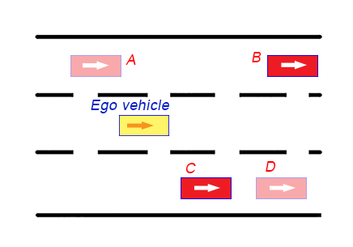

# CarND-Path-Planning-Project

Self-Driving Car Engineer Nanodegree Program

## Introduction

This project implements a Path Planning algorithm to dynamically build a path around a virtual track in a way that minimizes travelling time and avoids collisions with other vehicles.
   
### Goals

In this project the goal is to safely navigate around a virtual highway with other traffic that is driving ±10 MPH of the 50 MPH speed limit. The simulator provides the car's localization and sensor fusion data, there is also a sparse map list of waypoints around the highway. The car should try to go as close as possible to the 50 MPH speed limit, which means passing slower traffic when possible, while other cars will try to change lanes too. The car should avoid hitting other cars at all cost as well as driving inside of the marked road lanes at all times, unless going from one lane to another. The car should be able to make one complete loop around the 6946m highway. Since the car is trying to go 50 MPH, it should take a little over 5 minutes to complete 1 loop. Also the car should not experience total acceleration over 10 m/s^2 and jerk that is greater than 10 m/s^3.

## Project Implementation

### File structure

All the source files are located in the `src` folder and its subfolders.

#### Dependencies

The project uses 3rd-party libraries suggested in the classroom.

1. `json/json.hpp` is a C++ JSON library.
1. `spline/spline.h` is a C++ Spline library.

#### Project structure

1. `cost.cpp` and `cost.hpp` contain classes `Collision`, `TrajectoryCost`, `Simulation`.
1. `main.cpp` is the main project file.
1. `planner.cpp` and `planner.hpp` contain `PathPlanner` class.
1. `settings.cpp` and `settings.hpp` contain most of the constants defining various project settings.
1. `state.cpp` and `state.hpp` contain enum `VehicleState` and constant `SuccessorStates`.
1. `traffic.cpp` and `traffic.hpp` contain structure `VehiclePoints` and class `Traffic`.
1. `trajectory.cpp` and `trajectory.hpp` contain class `Trajectory`.
1. `utils.cpp` and `utils.hpp` contain various helper functions and class `SNormalizer`. Many of the helper functions were moved from supplied `main.cpp`.
1. `waypoint.cpp` and `waypoint.hpp` contain `WayPointsConstAcceleration` class.

### Classes and Data Types

#### `VehicleState`

Enum `VehicleState` defines one of 4 possible states the ego vehicle can be in:

1. `Initialize` is the initial state that the vehicle gets. The vehicle doesn't start moving when it's in this state and the project publishes no waypoints. The only purpose of this state is to detect the vehicle's initial lane.
1. `KeepLane` is the state that allows the vehicle to move forward in its lane.
1. `ChangeRight` is the state that the vehicle has when changing lane right.
1. `ChangeLeft` is the state that the vehicle has when changing lane left.

The constant `SuccessorStates` defines a mapping from each state to its possible successor states.

#### `PathPlanner`

Class `PathPlanner` is responsible for building a set of trajectories, then using `Traffic` and `Simulation` classes to predict future position of vehicles on the road detected by sensor fusion and running simulations for each trajectory. Finally the class selects the best trajectory, which is a trajectory with the lowest cost that doesn't lead to a collision with another vehicle.

#### `Traffic`

Class `Traffic` takes sensor fusion data as input and predicts future positions for each vehicle on the road detected by sensor fusion module. Additionally, the class maintains a list of closest vehicles to the ego vehicle in each lane.

#### `VehiclePoints`

Structure `VehiclePoints` contains a list of `s`-coordinates for predicted waypoints of other vehicles and a single value of `d`-coordinate. This way of storing future data does not take into account that vehicles may be in process of changing lanes, however tests with the simulator demonstrated good results. In real life future predictions should take into account change of `d` coordinate too.

#### `WayPointsConstAcceleration`

Class `WayPointsConstAcceleration` implements an algorithm of computing waypoints distributed along a straight line with variable distances which represents vehicle movement with constant acceleration or deceleration. Once the algorithm reaches target speed, distance between waypoints becomes fixed, which corresponds to linear motion.

#### `Simulation`

Class `Simulation` iterates over waypoints of an ego vehicle trajectory and checks them against waypoints of other vehicles predicted by class `Traffic`. This allows to detect possible future collisions and compute trajectory cost based on this information.

#### `Trajectory`

Class `Trajectory` contains a list of waypoint coordinates for a computed ego vehicle trajectory in the form of `x`, `y` pairs as well as `s`, `d` pairs.

#### `Collision`

Class `Collision` represents a future possible collision between the ego vehicle and another vehicle on the road detected by sensor fusion. Instances of the class are created when running simulation for computed trajectories. Although the class contains various information about a collision, in the current implementation that data is not used, and existence of a `Collision` instance is used as a binary flag to reject corresponding trajectory.

#### `TrajectoryCost`

Instances of `TrajectoryCost` class are created by `Simulation` to represent safety and benefits of different trajectories relative to each other.

#### Diagram

A high-level class diagram is provided below.

### Workflow

#### `main` (main.cpp)

`main.py` creates an instance of `PathPlanner` (line 69) and sets up WebSocket `Hub` with handler function `onMessage`. The handler function is called when the project receives updates from the simulator at runtime. The handler extracts relevant data from the message and calls `planner.Handle` (line 107) to generate updated waypoints. The list of generated waypoints is downsized to `NumPointsToReport` elements (lines 117-123) and passed to the simulator in an outgoing message.

#### `PathPlanner`

##### `PathPlanner::Handle` (planner.cpp)

`Handle` creates an instance of `Traffic` (line 23) and then branches execution based on the current vehicle state.

Class `Traffic` computes predictions for each vehicle included in `sensor_fusion` data. These predictions are later used to run simulations of different trajectories and detecting possible collisions.

For state `Initialize` the function calls `GetLaneIndex` and if lane is detected successfully changes the state to the next possible state (lines 27-30). For state `KeepLane` the function calls `HandleKeepLane` (lines 34-37). States `ChangeRight` and `ChangeLeft` are handled by the same function `HandleChangeLane` (lines 24).

##### `PathPlanner::HandleKeepLane` (planner.cpp)

`HandleKeepLane` generates multiple trajectories and selects the best trajectory based on its cost.

It starts with generating *keep lane trajectories*, i.e. trajectories for diving ahead in the current lane. For each allowed speed value defined in `KeepLaneVelocities` constant the function generates a new trajectory and stores it in `trajectories` variable (lines 61-72).

Then the function computes allowed velocities for lane change maneuver which are defined as current speed + 20%, current speed + 10%, current speed, current speed - 10% and current speed - 20%. These values are stored in the variable `ChangeLaneVelocities` (lines 75-96).

Then, using computed velocities, the function generates trajectories for changing lane left (lines 99-115) and changing lane right (lines 118-133). For each trajectory the function computes `maneuverLength`, the value from 50% to 100% of maximum allowed length `ChangeLaneMaxManeuverLength`. Changing maneuver length proportionally to vehicle speed allows to make faster lane changes at lower speeds and smoother lane changes at higher speeds. Generated trajectories are appended to the `trajectories` list.

The set of generated trajectories is shown on the illustration below.

After trajectories are generated, the function runs simulations for all of them calling `RunSimulations` function (line 136). Simulations allow to compare predicted vehicle position for each trajectory with predicted positions of other vehicles stored in variable `traffic` and detect potential collisions.

Results of simulations are passed to `FindBestSimulationIndex` (line 139) which either returns a 0-based index if a safe trajectory is found or returns `-1` if all trajectories lead to a collision. If the best trajectory index is returned, then appropriate trajectory is accepted (line 144) otherwise a *fallback strategy* is executed.

The fallback strategy code branch (lines 146-157) locates the vehicle that drives immediately ahead of the ego vehicle in the current lane, takes the leading vehicle speed decreased by 20% as target speed and computes a new *keep lane* trajectory. This way the function guarantees that the ego vehicle is safe and avoids collision with the vehicle in front of it.

Finally the function moves computed `x` and `y` coordinates of the best selected trajectory to variables `path_x` and `path_y` and updates `state`, `target_lane_index` and `target_speed` (lines 160-165).

##### `PathPlanner::HandleChangeLane` (planner.cpp)

`HandleChangeLane` calls `GenerateTrajectory` to get the change lane trajectory and then assigns `x` and `y` coordinates of trajectory waypoints to variables `path_x` and `path_y` (lines 177-186).

Before returning, the function checks current vehicle position in a lane by calling `GetLaneIndex`, which returns `-1` if the vehicle is displaced from lane center, and 0-based lane index if the vehicle is close to lane center. If returned value is equal to `target_lane_index`, the function changes current state to the next valid state and sets current lane index to target lane index (lines 189-192).

`HandleChangeLane` does not check sensor fusion data to detect possible collision with nearby vehicles. This still allows to drive safely in the simulator environment, however it would not be acceptable in the real world. To exclude risk of collision during lane change, the function would have to implement a similar strategy that `HandleKeepLane` applies, which is to generate multiple trajectories and select the best safe trajectory based on trajectory cost.

##### `PathPlanner::GenerateTrajectory` (planner.cpp)

`GenerateTrajectory` generates waypoints of a single trajectory for the ego vehicle.

The high-level algorithm of waypoint generation is to (1) build a list of anchor points, (2) fit a spline, (3) re-use waypoints computed on the previous iteration, (4) add to the list waypoints located on the spline.

The function builds anchor points in three steps. First, it either adds the current vehicle position to the list of anchor points with another anchor point generated using car yaw angle (lines 229-232) or uses previous path points (lines 234-239). Then it computes anchor points that lead the vehicle from the current lane to the target lane in case current and target lanes differ, or along the current lane if the trajectory doesn't change lanes (lines 250-276). While doing that, the function computes number of anchor points to add based on desired maneuver length (lines 253-259). The last step of anchor points generation is to rotate them about the last anchor point added before staring lane change maneuver computed earlier (lines 244-246). Rotation angle is computed in a way that places the last anchor point straight ahead (lines 279-288). This is the algorithm suggested in the project walkthrough video.

The function fits a spline into the list of anchor points (line 291) and then copies waypoints computed on the previous iteration that the vehicle has not yet driven through (lines 294-295). Number of waypoints to reuse is capped at `NumPointsToReuse` value. This allows to react on the changed traffic conditions faster.

After fitting the spline and copying old waypoints, the function computes new waypoints. It determines vehicle speed at the last reused waypoint (line 301) and then uses `WayPointsConstAcceleration` class to compute waypoint coordinates located on the spline (lines 313-317). Distance between computed waypoints is fixed if target speed equals current speed, is increasing if target speed is higher than current speed or decreasing if target speed is lower than current speed. The function converts waypoint coordinates to global space and adds them to `next_x_vals`, `next_y_vals` (lines 320-328).

Finally the function creates and returns a new instance of `Trajectory` class that holds the list of waypoints and other related data (lines 330-333).

##### `PathPlanner::RunSimulations` (planner.cpp)

Function `RunSimulations` iterates over the list of trajectories, and for each trajectory creates a new instance of class `Simulation` (line 345). In case a simulation doesn't detect a collision, the simulation is added to the list of 'accepted' simulations (line 349). The function returns the list of safe simulations, which is later used to compare cost of trajectories and pick the best one.

##### `PathPlanner::FindBestSimulationIndex` (planner.cpp)

Function `FindBestSimulationIndex` uses the list of previously performed simulations and associated costs of trajectories to select the best trajectory to build waypoints from. It initializes `bestTrajectoryCost` with a maximum possible value (line 374) and `bestSimulationIndex` with `-1` (line 375). While iterating over simulations, the function compares cost of each simulation with the best found simulation so far and updates `bestTrajectoryCost` and `bestSimulationIndex` (lines 388-389). Thus, if at least one simulation ends without a collision, `bestSimulationIndex` gets a non-zero value, otherwise it holds the initial value `-1`.

#### `Traffic`

##### `Traffic::Traffic` (traffic.cpp)

Constructor of class `Traffic` initiates the process of predicting waypoints for other vehicles. It iterates over elements of `sensor_fusion` parameter and calls `PredictWaypoints` for each element (lines 7-9).

After making predictions, the constructor calls `FindNextInLanes` to find vehicles in front of the ego vehicle in each lane.

##### `Traffic::PredictWaypoints` (traffic.cpp)

Function `PredictWaypoints` takes sensor fusion data for a single vehicle as input and predicts its future waypoints. The function computes vehicle's `s` and `d` coordinates (lines 19-20) and linear speed (line 23). Then it computes distance to the ego vehicle (lines 25-26) and determines vehicle position relative to the ego vehicle: *Side*, *Front* or *Rear* (lines 34-40).

After that the function runs a loop with `num_points` iterations. On each iteration the function computes time it takes to reach the waypoint (line 43) and future value of `s` coordinate (line 46). The function assumes constant vehicle velocity and ignores uncertainty. This works well for the simulated environment, however modelling uncertainty with a Gaussian distribution would be a better approach for a real-life application.

##### `Traffic::FindNextInLanes` (traffic.cpp)

Function `FindNextInLanes` iterates over current positions of sensed vehicles (line 55), detects lane index of each vehicle (line 58) and `s` coordinate (line 59). The function ignores vehicles outside of three road lanes as well as vehicles more than 300 meters away from the ego vehicle (lines 62-64).

Array `nextInLane` contains references to `VehiclePoints` instances for vehicles ahead of ego vehicle in each lane. Array is initialized with `nullptr` values (traffic.hpp, line 78). The function updates the array as it finds nearby vehicles (lines 66-68).

The process is illustrated on the image below. Vehicle *A* is ignored because it's located behind the ego vehicle. Vehicles *B* and *C* are accepted, vehicle *D* is ignored because it's not the closest vehicle in its lane.

#### `WayPointsConstAcceleration` (waypoints.cpp)

Class `WayPointsConstAcceleration` computes future waypoints for the ego vehicle and stores the result in its fields `x_points` and `y_points` (waypoints.hpp, lines 51-52).

Each pair of adjacent waypoints is spread 20 milliseconds apart in time, so distance between the points on the road surface determines vehicle speed. The function takes `current_speed` and `target_speed` as parameters. If these values are equal, distance between points doesn't change as the function computes waypoints. If `target_speed` is higher than `current_speed`, distance between waypoints increases with time. Conversely, if `target_speed` is lower than `current_speed`, distance between waypoints decreases with time.

Class constructor performs all the computations. It runs a loop with `n_points` iterations (line 23). Each iteration starts with updating the value of speed `v`. If speed is close to `target_speed`, `v` gets fixed at target speed value (lines 24-26), otherwise the value of `v` is changed towards `target_speed` by `SpeedChangeStep`, which is a proxy for acceleration.

After adjusting the speed the function computes `x` and `y` coordinates for the next waypoint (lines 40-45). It increases `x` coordinate by `v` and then computes `y` coordinate by calling supplied callback function, which is supposed to make a call to `spline` (planner.cpp, line 315). When waypoints are located along a straight line, the algorithm works well and allows to maintain constant speed. However, when driving in turns along a curved path, the algorithm can result in exceeding maximum allowed speed. This is illustrated on the image below. Horizontal distances between waypoints marked A and B are equal, however Euclidean distance between two waypoints marked C is greater than the horizontal distance B due to the added vertical component.

The function avoids exceeding the maximum speed caused by the effect described above by computing linear speed between two points (line 48) and comparing it to the maximum allowed speed (line 51). If the actual speed exceeds maximum, computation is repeated with the value of `v` decreased by 5% (lines 52-64).

Computed coordinates are stored in the lists `x_points` and `y_points` (lines 73-74).

#### `Simulation`

Class `Simulation` compares position of the ego vehicle at each computed waypoint with predicted positions of other vehicles at the corresponding time in future. For each waypoint, the class checks the distance from the ego vehicle to each of the other vehicles on the road. If the distance is lower than a threshold, the trajectory is considered unsafe and leading to a collision.

The process of simulation is illustrated on the image below. The same set of checks is performed for every waypoint. For a single waypoint that corresponds to time *t*, predicted positions of other vehicles at the same time *t* are taken into consideration.

For example, position of the ego vehicle at waypoint *P* is compared with predicted positions of vehicles 1 and 2 made for the same time in future. Future distance from the ego vehicle to vehicle 1 is marked *A*, future distance to vehicle 2 is marked *B*. Values A and B are checked against corresponding thresholds, different for vehicles approaching from behind and vehicles in front of the ego vehicle.

The values of *A* and *B* are larger than vehicle length. Setting large thresholds allows to account for uncertainty when predicting future vehicle positions, and to avoid collisions when traffic starts accelerating or decelerating.

##### `Simulation::Simulation` (cost.cpp)

Constructor of class `Simulation` calls functions to detect collisions (line 34), compute proximity to other vehicles (line 35) and to compute trajectory cost (line 37).

##### `Simulation::GetVehiclesInEgoLanes` (cost.cpp)

`GetVehiclesInEgoLanes` is a helper function that iterates over list of `VehiclePoint` instances and filters out those that do not correspond to vehicles driving in the same lanes where the ego vehicle drives.

The function gets low and high lane index of the ego vehicle (lines 43-44), the for each `VehiclePoints` instance it compares future lane index with ego lane index interval (line 52). If lane index is within the interval, `VehiclePoints` is appended to the result set (line 53).

##### `Simulation::DetectCollision` (cost.cpp)

Function `DetectCollision` iterates over waypoints and for each waypoint compares position of the ego vehicle with positions of other vehicles.

The function computes two boolean values `safeInCurrentLane` and `safeLaneChange`.

`safeInCurrentLane` indicates whether the ego vehicle can drive safely in its current lane, which means when the other vehicle is more than `SafeKeepLaneDistanceAhead` meters ahead or more than `SafeKeepLaneDistanceBehind` meters behind (lines 84-87).

Similarly, `safeLaneChange` compares the distance to the other vehicle against `SafeTargetLaneDistanceAhead` and `SafeTargetLaneDistanceBehind` (lines 90-93).

If according to prediction the ego vehicle comes too close to the other vehicle, the function creates an instance of `Collision` class and assigns it to the `collision` field (lines 101-130).

##### `Simulation::ComputeObstacleProximity` (cost.cpp)

Function `ComputeObstacleProximity` locates the closest vehicle in the current ego vehicle lane ahead of the ego vehicle and stores its speed and proximity (distance to the vehicle) in fields `obstacleSpeed` and `obstacleProximity` (lines 141-142).

##### `Simulation::ComputeCost` (cost.cpp)

Function `ComputeCost` computes cost components for a trajectory.

Lane change cost is computed as the absolute difference between current lane index and target lane index. For lane change right the cost is doubled. This allows to select 'change left' trajectory over 'change right' trajectory when both trajectories are safe (lines 147-151).

Speed cost is computed as a reciprocal of target speed value. This way, higher speeds get lower costs. If vehicle speed is zero, the cost is set to 1. (lines 153-158). If the ego vehicle is not changing lane and it comes too close to the vehicle in front of it (closer than `SafeDistance` value), then the speed cost is doubled. This allows to maintain a safe distance and decrease speed when lane change is not possible due to other traffic (lines 161-164).

Similarly, obstacle proximity cost is a reciprocal of obstacle proximity value (lines 166-168).

Maneuver cost is computed as 0 for keep lane trajectories (which have maneuver length equal to 0). For change lane trajectories, maneuver cost is a reciprocal of maneuver length. This way longer and smoother lane changes are preferred (lines 170-176).

In case of a collision, collision cost is set to a non-zero value (lines 181-193). Although the cost can take different values, it is not used, and any trajectory with a collision is rejected. The function also computes collision time cost as a reciprocal of collision time measured from the moment of simulation start (lines 195-199). Similarly to collision cost, this value has no real effect.

#### `TrajectoryCost`

##### `operator<` (cost.cpp)

`TrajectoryCost` (cost.hpp, lines 60-92) stores all the cost components described above in the `ComputeCost` section. Comparison of different `TrajectoryCost` instances is performed by `operator<`. The operator does not compute a single cost value. Instead, it performs pairwise comparisons of individual cost components. In case of a tie, it advances to the next component, otherwise it returns a value to select component with the lower cost.

The order of component comparison is the following:
1. `collisionCost`
1. `collisionTimeCost`
1. `speedCost`
1. `obstacleProximityCost`
1. `maneuverCost`
1. `laneChangeCost`

Strict comparison is performed for the pair of `laneChangeCost` values, which is the last comparison, to serve as a tiebreaker (line 239).

Not computing a single cost value can be limiting in case of a complex const function, as it doesn't allow to account for interactions between different cost parts when one cost part overweighs another cost part. The implemented approach, however, works well for the project.
